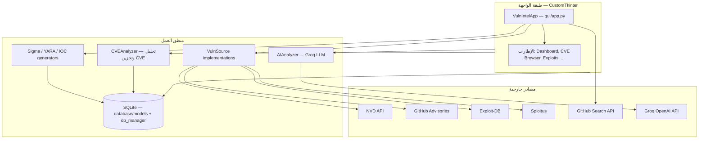
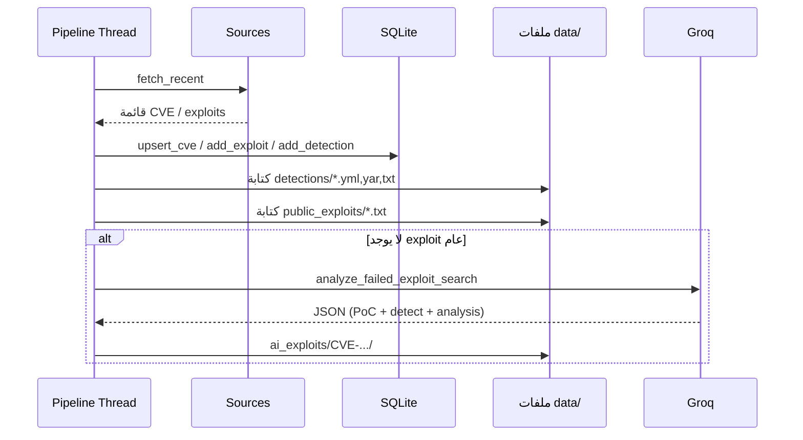

# المعمارية، مسار البيانات، والواجهة — شرح شامل

هذا الملف يلخص **كيف يترابط المشروع**، **من أين تأتي البيانات**، **أين تُخزَّن**، **ما الذي يحدث في كل دورة مراقبة**، و**شكل الواجهة والتنقل**.

---

## 1. رسم معماري من الطبقات

---

## 2. مسار البيانات — ملخص سريع

1. **جلب CVEs**: مصادر (`sources/*`) تستدعي APIs أو scraping وتُرجع قوائم `dict` موحّدة الشكل تحتوي على `cve_id`, `description`, …  
2. **التخزين**: `CVEAnalyzer.store_source_results` → `DatabaseManager.upsert_cve` + مراجع في `refs`.  
3. **الاكتشافات**: مولدات (`generators/*`) تُنشئ Sigma / YARA / IOC وتُحفظ كملفات تحت `data/detections/` وتُسجَّل في جدول `detections`.  
4. **الاستغلال العام**: البحث في Exploit-DB + Sploitus + GitHub؛ الأفضل يُختار (اختياريًا عبر AI) ويُحفظ في `data/public_exploits/` وفي جدول `exploits`.  
5. **الاستغلال بالـ AI**: إذا لم يُوجد exploit عام، يستدعي Groq ويُخرج مجلدًا تحت `data/ai_exploits/<CVE-ID>/` (تحليل، PoC، `detect.py`, …).  
6. **الواجهة**: تقرأ من SQLite وتعرض الإطارات؛ السجل الحي يظهر في Dashboard.

---

## 3. خط أنابيب الخلفية التلقائي (`gui/app.py` — `_pipeline_loop`)

يعمل في **thread منفصل** عن Tk؛ لا يوقف الواجهة.

### المرحلة 1 — مزامنة المصادر

لكل مصدر في القاموس:

`nvd`, `github` (GitHub Advisories), `exploitdb`, `sploitus`:

- `fetch_recent(days_back=7, limit=40)`  
- النتائج تمر عبر `CVEAnalyzer.store_source_results` → CVEs + refs في DB.  
- إذا كان المصدر exploitdb أو sploitus ولديه `exploit_url` يُضاف exploit إلى DB.

### المرحلة 2 — توليد قواعد الاكتشاف لكل CVE في DB

لكل CVE:

- إن لم تكن موجودة أنواع sigma / yara / ioc بعد، يُولَّد ما ينقص ويُكتب تحت `data/detections/` ويُسجَّل في `detections`.

### المرحلة 3 — بحث الاستغلال + AI

لكل CVE حيث `has_public_exploit` غير محقق:

1. بناء **استعلامات بحث**: CVE ID، منتج من `affected_products`، كلمات من الوصف، + استعلامات إضافية من **AI** (`generate_exploit_search_queries`).  
2. **بحث متوازي** في exploitdb و sploitus لكل استعلام.  
3. **بحث GitHub** (`_search_github_exploits`) لاستعلامات مختارة.  
4. تجميع المرشحين؛ إن وُجد تطابق CVE أو مرشحين عامين → **اختيار أفضل** (AI اختياري) → حفظ مرجع في `public_exploits/` وتنزيل raw من روابط `github.com/.../blob/...` عند الإمكان.  
5. إن **`cve_exploits_found == 0`**: استدعاء `analyze_failed_exploit_search` → تحليل JSON من Groq → مجلد `data/ai_exploits/<CVE>/`.

بعد كل CVE يدوّي تعامل مع Groq قد يُتبع بـ `time.sleep(10)` لتخفيف TPM.

### انتظار الدورة التالية

`DEFAULT_SYNC_INTERVAL` (من `config.py`) ثوانٍ بين الدورات.

---

## 4. مخطط تسلسل مبسّط (Pipeline → DB → ملفات)

---

## 5. مخطط قاعدة البيانات (منطقي)

| الجدول | الغرض |
|--------|--------|
| `cves` | سجل كل CVE مع CVSS، الشدة، المنتجات، نضج الاستغلال، إلخ. |
| `exploits` | روابط أو مراجع exploits مرتبطة بـ `cve_id`. |
| `refs` | مراجع خارجية للـ CVE. |
| `detections` | محتوى أو مسار قواعد Sigma/YARA/IOC. |
| `lab_results` | نتائج اختبار مختبر لاحقًا. |
| `lab_targets` | أهداف مختبر مسجّلة. |

التفاصيل في [database/models.md](database/models.md).

---

## 6. الواجهة — الشكل والتنقل

### نافذة رئيسية (`VulnIntelApp`)

- **شريط جانبي (Sidebar)** ~240px: شعار، حالة الـ Pipeline (نقطة ملونة + نص)، عناصر تنقل، زر **Force Sync**، زر **Stop/Start Monitor**، تذييل حالة، صندوق **Safety: ENFORCED**.  
- **منطقة محتوى**: تعرض إطارًا واحدًا نشطًا؛ عند التبديل يُستدعى `refresh()` إن وُجد.

### عناصر التنقل (بالترتيب في الكود)

| المعرف | العنوان المعروض |
|--------|-----------------|
| `dashboard` | Dashboard |
| `cve_browser` | CVE Browser |
| `exploits` | Exploits |
| `public_search` | Public Search |
| `target_analysis` | Target Analysis |
| `queue` | Queue |
| `detections` | Detections |
| `lab` | Lab |
| `reports` | Reports |
| `settings` | Settings |

الزر النشط يُظهر خلفية `bg_tertiary` ولون نص `accent_primary`.

### أين يُنشأ كل إطار

كلها أبناء `content_area`؛ التبديل عبر `_show_frame(name)` يخفي الإطار السابق ويعرض الجديد.

### ربط الإطارات بالبيانات

| الإطار | يعتمد على |
|--------|-----------|
| Dashboard | `DatabaseManager`، بطاقات KPI، CVE حديثة، سجل نصي (`append_log`) |
| CVE Browser | بحث/عرض CVE من DB |
| Exploits | جدول `exploits` |
| Public Search | بحث عام + AI |
| Target Analysis | تحليل هدف عبر AI |
| Queue | طابور مهام يدوي + مصادر + analyzer |
| Detections | جدول `detections` |
| Lab | `LabManager` |
| Reports | تقارير من المولدات |
| Settings | إعدادات التطبيق (`app_ref`) |

---

## 7. خيط التنفيذ (Threading)

- **`_pipeline_loop`** يعمل على **daemon thread** باستمرار طالما `_monitoring` مفعّل.  
- تحديثات الواجهة من الخيط الخلفي تمر غالبًا عبر `self.after(0, …)` أو دوال تستخدم `after` داخلها (`_log_to_ui` يستدعي dashboard الذي يستخدم `after` في `append_log`).

---

## 8. الذكاء الاصطناعي (Groq)

- **لا يوجد “محادثة متراكمة” بين CVEs**: كل استدعاء `chat.completions` يرسل `system` + `user` فقط لهذه العملية.  
- حدود الطول والـ TPM تُدار عبر `config` (`GROQ_MAX_OUTPUT_TOKENS`, `GROQ_PROMPT_DESCRIPTION_MAX_CHARS`, إلخ) وتقليص النص في بعض الدوال — انظر [analysis/ai_analyzer.md](analysis/ai_analyzer.md).

---

## 9. السلامة

`analysis/safety_policy.py` + `SAFETY_POLICY` في `config.py`: تحقق من أهداف المختبر، أنماط خطرة في المحتوى، إلخ. التفاصيل في [analysis/safety_policy.md](analysis/safety_policy.md).

---

هذا الملف مرجع **عالي المستوى**؛ تفاصيل كل ملف `.py` في الملف المسمّى بنفس المسار تحت `docs/`.
